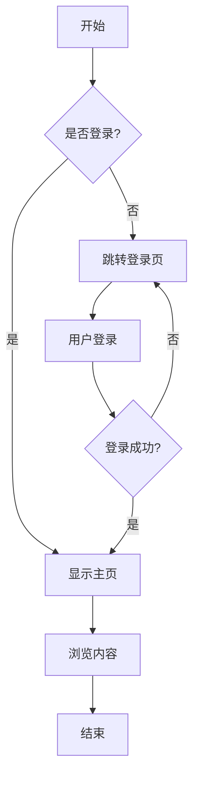
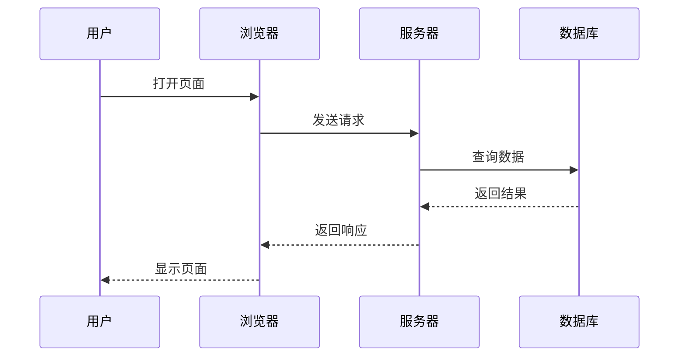
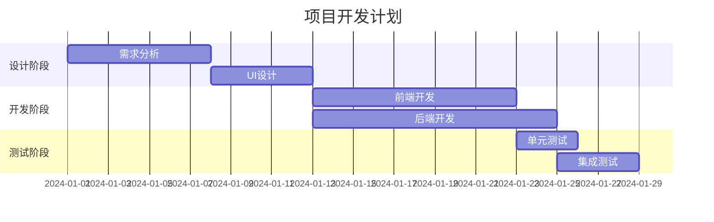
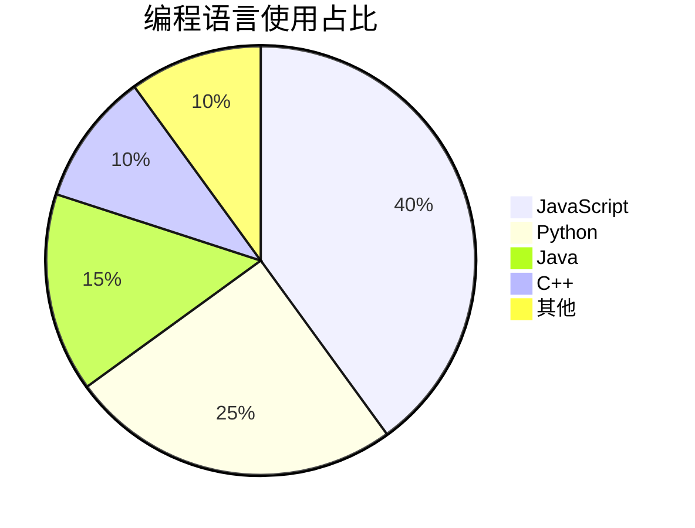
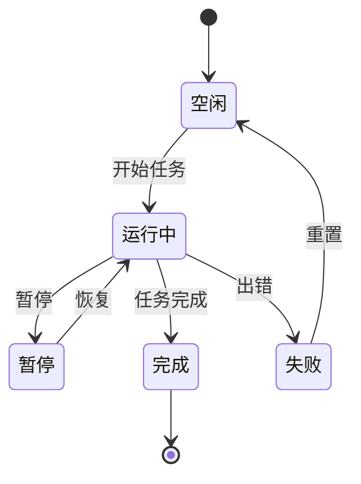
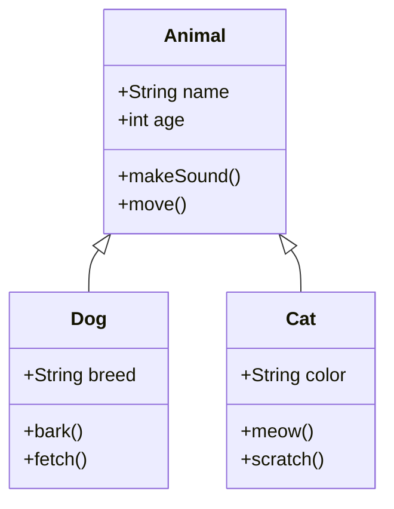

# MD Viewer 完整功能演示

这个文档展示了 MD Viewer 支持的所有 Markdown 格式和功能。

## 📝 基础文本格式

### 文本样式

- **粗体文本**
- *斜体文本*
- ***粗斜体文本***
- ~~删除线文本~~
- ==高亮文本==（部分渲染器支持）
- `行内代码`
- <u>下划线</u>（HTML 标签）
- H~2~O（下标）
- X^2^（上标）

### 特殊字符

使用 <kbd>Ctrl</kbd> + <kbd>S</kbd> 保存文件

---

## 📋 列表

### 无序列表

- 水果
  - 苹果
  - 香蕉
    - 小香蕉
    - 大香蕉
  - 橙子
- 蔬菜
  - 番茄
  - 黄瓜

### 有序列表

1. 第一步：打开文件夹
2. 第二步：选择文件
3. 第三步：开始编辑
   1. 子步骤 A
   2. 子步骤 B
4. 第四步：保存文件

### 任务列表

- [x] 完成项目初始化
- [x] 添加基础功能
- [x] 代码高亮支持
- [x] 数学公式支持
- [x] 流程图支持
- [ ] 添加导出 PDF 功能
- [ ] 多语言支持

---

## 💻 代码块

### JavaScript

```javascript
// 异步函数示例
async function fetchData(url) {
    try {
        const response = await fetch(url);
        const data = await response.json();
        return data;
    } catch (error) {
        console.error('Error fetching data:', error);
        throw error;
    }
}

// 使用箭头函数
const greet = (name) => `Hello, ${name}!`;
console.log(greet('MD Viewer'));
```

### Python

```python
# 数据处理示例
import pandas as pd
import numpy as np

def process_data(df):
    """处理数据框"""
    # 删除空值
    df_clean = df.dropna()
    
    # 计算统计信息
    stats = {
        'mean': df_clean.mean(),
        'std': df_clean.std(),
        'count': len(df_clean)
    }
    
    return stats

# 装饰器示例
def timer(func):
    def wrapper(*args, **kwargs):
        import time
        start = time.time()
        result = func(*args, **kwargs)
        end = time.time()
        print(f"执行时间: {end - start:.2f}秒")
        return result
    return wrapper
```

### HTML/CSS

```html
<!DOCTYPE html>
<html lang="zh-CN">
<head>
    <meta charset="UTF-8">
    <title>示例页面</title>
    <style>
        .container {
            max-width: 1200px;
            margin: 0 auto;
            padding: 20px;
            background: linear-gradient(135deg, #667eea 0%, #764ba2 100%);
        }
    </style>
</head>
<body>
    <div class="container">
        <h1>Hello World!</h1>
    </div>
</body>
</html>
```

### SQL

```sql
-- 复杂查询示例
SELECT 
    u.username,
    COUNT(o.id) as order_count,
    SUM(o.total_amount) as total_spent
FROM users u
LEFT JOIN orders o ON u.id = o.user_id
WHERE o.created_at >= DATE_SUB(NOW(), INTERVAL 30 DAY)
GROUP BY u.id
HAVING total_spent > 1000
ORDER BY total_spent DESC
LIMIT 10;
```

---

## 📊 表格

### 基础表格

| 功能 | 支持 | 优先级 | 说明 |
|------|:----:|:------:|------|
| GFM 语法 | ✅ | 高 | GitHub Flavored Markdown |
| 代码高亮 | ✅ | 高 | 支持 180+ 种语言 |
| 数学公式 | ✅ | 中 | KaTeX 渲染 |
| 流程图 | ✅ | 中 | Mermaid 支持 |
| 图表 | ✅ | 低 | 各种图表类型 |

### 对齐示例

| 左对齐 | 居中对齐 | 右对齐 |
|:-------|:-------:|-------:|
| 内容1 | 内容2 | 内容3 |
| A | B | C |
| 很长的内容 | 中等 | 短 |

---

## 🔗 链接和图片

### 链接

- [外部链接](https://github.com)
- [带标题的链接](https://www.google.com "Google 搜索")
- [内部锚点](#数学公式)
- <https://www.example.com>
- 自动链接: www.example.com

### 图片


---

## 📐 数学公式

### 行内公式

这是一个行内公式：$E = mc^2$，爱因斯坦的质能方程。

勾股定理：$a^2 + b^2 = c^2$

### 块级公式

$$
\frac{-b \pm \sqrt{b^2 - 4ac}}{2a}
$$

**矩阵示例：**

$$
\begin{bmatrix}
a & b & c \\
d & e & f \\
g & h & i
\end{bmatrix}
$$

**求和公式：**

$$
\sum_{i=1}^{n} i = \frac{n(n+1)}{2}
$$

**积分：**

$$
\int_{0}^{\infty} e^{-x^2} dx = \frac{\sqrt{\pi}}{2}
$$

**复杂公式：**

$$
f(x) = \int_{-\infty}^{\infty} \hat{f}(\xi) e^{2\pi i \xi x} d\xi
$$

---

## 📈 流程图和图表

### Mermaid 流程图



### 序列图



### 甘特图



### 饼图



### 状态图



### 类图



---

## 💬 引用

### 普通引用

> 💡 **提示**: 这是一个引用块。
> 
> 引用可以包含多行内容，以及 **格式化文本**、`代码`等。

### 嵌套引用

> 第一层引用
> > 第二层引用
> > > 第三层引用
> > > 
> > > 可以包含代码：`console.log('Hello')`

### 带作者的引用

> "生活就像一盒巧克力，你永远不知道下一颗是什么味道。"
> 
> —— 阿甘正传

---

## ⚠️ 提示框（自定义样式）

> ℹ️ **信息**
> 
> 这是一个信息提示框。

> ✅ **成功**
> 
> 操作已成功完成！

> ⚠️ **警告**
> 
> 请注意，这个操作可能会导致数据丢失。

> ❌ **错误**
> 
> 发生了一个错误，请重试。

---

## 📌 其他功能

### 脚注

这是一段包含脚注的文本[^1]。你也可以使用命名脚注[^note]。

[^1]: 这是第一个脚注的内容。
[^note]: 这是命名脚注的详细说明。

### 定义列表

HTML
: 超文本标记语言，用于创建网页的标准标记语言。

CSS
: 层叠样式表，用于描述网页的外观和格式。

JavaScript
: 一种高级的、解释型的编程语言。

### 缩写

HTML、CSS、JS 是前端开发的三大基础技术。

*[HTML]: HyperText Markup Language
*[CSS]: Cascading Style Sheets
*[JS]: JavaScript

### Emoji 支持

😀 😃 😄 😁 😆 😅 🤣 😂 🙂 🙃 😉 😊 😇

🚀 💡 📝 ✅ ❌ ⚠️ 📊 📈 🔧 🎯

---

## 🎨 HTML 嵌入

<div style="background: linear-gradient(135deg, #667eea 0%, #764ba2 100%); padding: 20px; border-radius: 10px; color: white; text-align: center;">
    <h3>这是嵌入的 HTML</h3>
    <p>可以使用自定义样式</p>
</div>

<details>
<summary>点击展开/收起</summary>

这是隐藏的内容，点击上面可以展开或收起。

可以包含：
- 列表
- **格式化文本**
- `代码`

</details>

---

## 📝 总结

MD Viewer 支持：

1. ✅ **完整的 GFM 语法**
2. ✅ **180+ 种语言的代码高亮**
3. ✅ **数学公式渲染（KaTeX）**
4. ✅ **Mermaid 流程图和图表**
5. ✅ **任务列表**
6. ✅ **表格对齐**
7. ✅ **Emoji 支持**
8. ✅ **脚注和定义列表**
9. ✅ **HTML 嵌入**
10. ✅ **实时编辑和保存**

---

**感谢使用 MD Viewer！** 🎉

如果你有任何问题或建议，欢迎反馈。

---

*最后更新: 2026-01-08*
