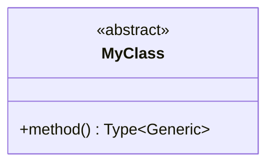
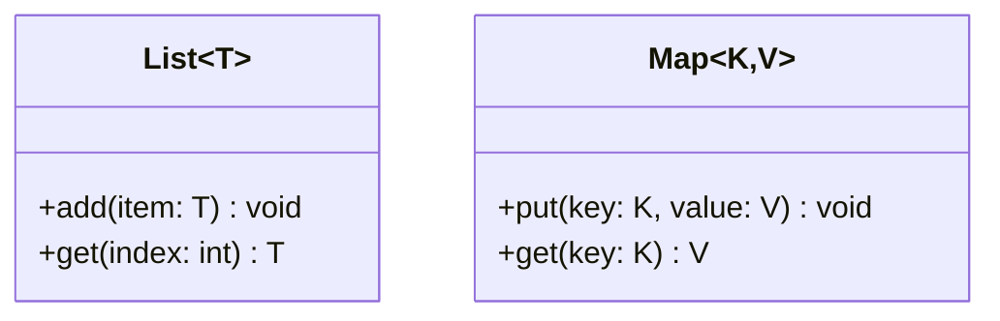
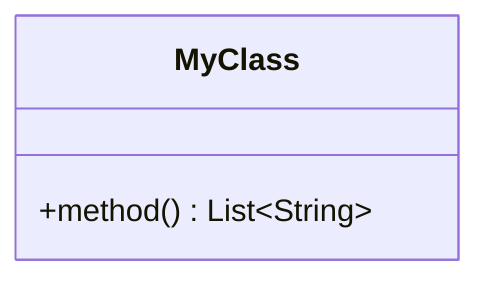
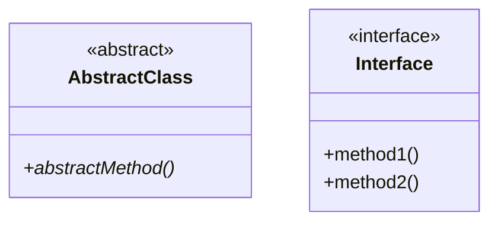
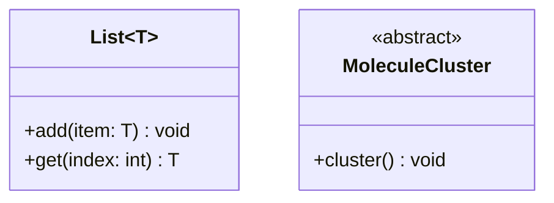
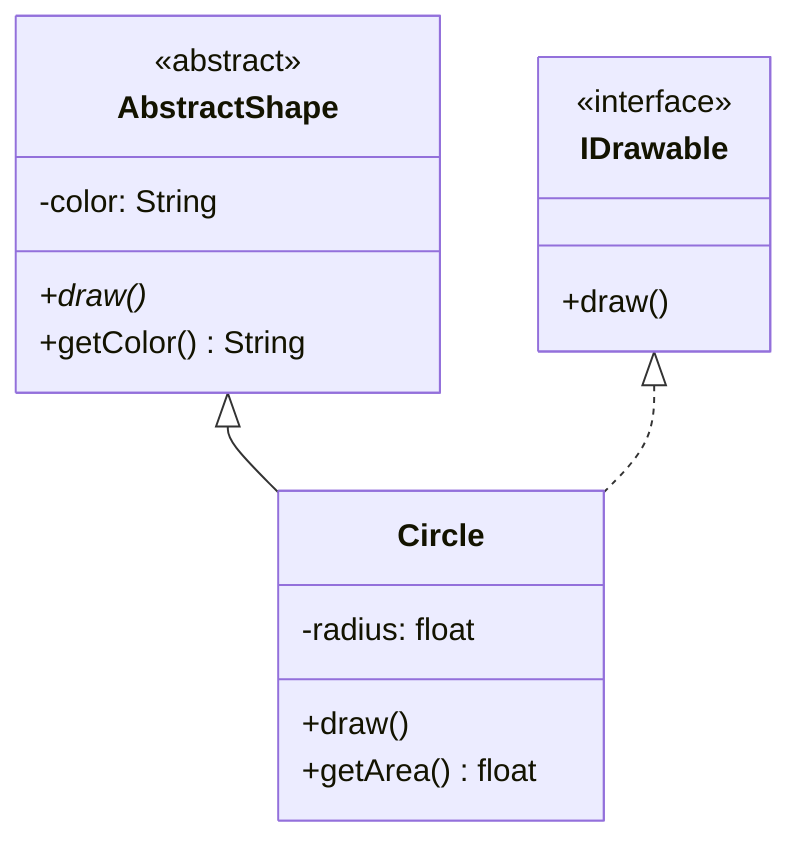
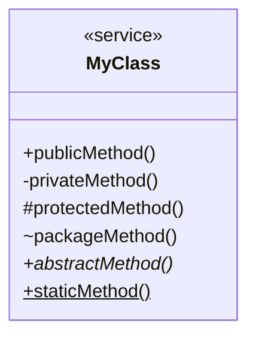
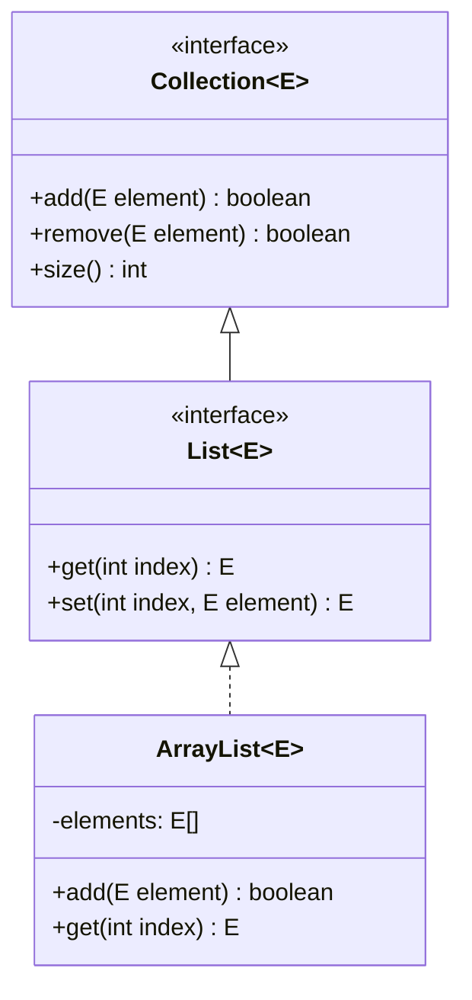
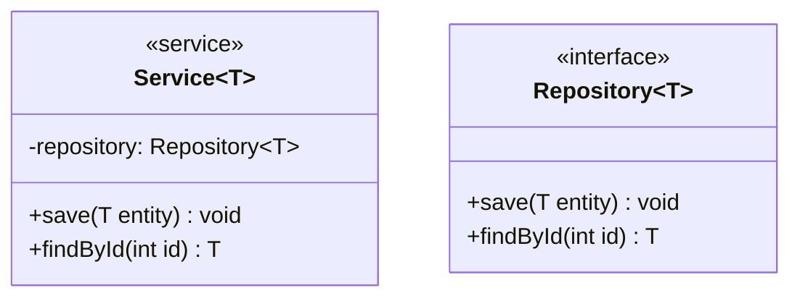

# Mermaid 类图特殊字符处理指南

## 常见问题

### 问题：尖括号 `<>` 导致解析错误

**错误信息**：
```
Parse error on line 105:
...terMoleculeClusterBP</abstract></abstrac
-----------------------^
Expecting 'NEWLINE', 'EOF', 'LABEL', got 'DEPENDENCY'
```

**原因**：Mermaid 将 `<abstract>` 误认为是 HTML 标签或依赖关系语法。

## 解决方案

### 方案 1: 使用双引号包裹 ✅ 推荐



或者包裹整个类名：

```mermaid
classDiagram
    class "MyClass<T>" {
        +getValue() T
    }
```

### 方案 2: 使用泛型符号 `~`

Mermaid 提供了专门的泛型语法：



### 方案 3: 使用 HTML 实体



### 方案 4: 使用 stereotype 标记

对于 abstract 类，使用 Mermaid 的内置标记：



## 特殊字符处理对照表

| 字符 | 问题 | 推荐写法 | 示例 |
|------|------|----------|------|
| `<>` | 被识别为HTML标签 | 使用 `~` 或引号 | `List~T~` 或 `"List<T>"` |
| `&` | HTML实体 | 使用 `&amp;` | `A &amp; B` |
| `"` | 字符串结束 | 转义 `\"` | `method(\"text\")` |
| `()` | 方法参数 | 正常使用 | `method(int x)` |
| `[]` | 数组 | 正常使用 | `items: int[]` |
| `*` | 抽象方法标记 | 方法后加 `*` | `+abstractMethod()*` |

## 完整示例：泛型类图

### ❌ 错误写法

```mermaid
classDiagram
    class List<T> {
        +add(item: T) void
        +get(index: int) T
    }
    class MoleculeCluster<abstract> {
        +cluster() void
    }
```

### ✅ 正确写法



## 抽象类和接口的标准写法



## 方法修饰符



修饰符说明：
- `+` public
- `-` private
- `#` protected
- `~` package/internal
- `*` abstract
- `$` static

## 常见模式

### 泛型集合类



### 依赖注入



## 调试技巧

1. **逐步测试**：如果图表很复杂，先注释掉一部分，找出问题所在
2. **检查引号**：确保所有引号成对出现
3. **检查换行**：每个定义后需要换行
4. **查看错误行号**：错误信息会提示具体的行号
5. **使用在线编辑器**：[Mermaid Live Editor](https://mermaid.live/) 可以实时预览

## 错误提示改进

从 v1.7.2 开始，MD Viewer 会在 Mermaid 渲染失败时显示：

- 🔴 明显的错误提示框
- 📝 详细的错误信息
- 📋 原始代码查看
- 💡 修复建议

不需要再打开控制台查看错误！

## 参考资源

- [Mermaid 官方文档 - 类图](https://mermaid.js.org/syntax/classDiagram.html)
- [Mermaid 泛型语法](https://mermaid.js.org/syntax/classDiagram.html#generics)
- [在线编辑器](https://mermaid.live/)
