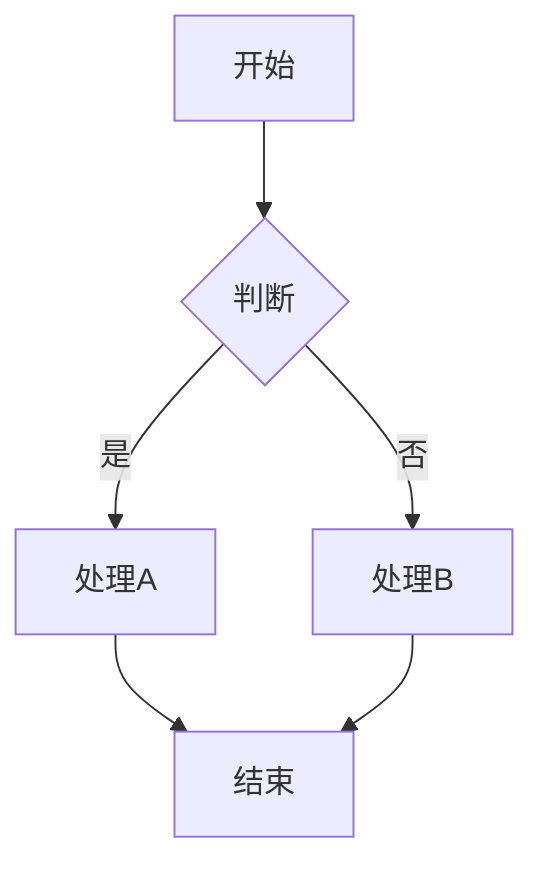
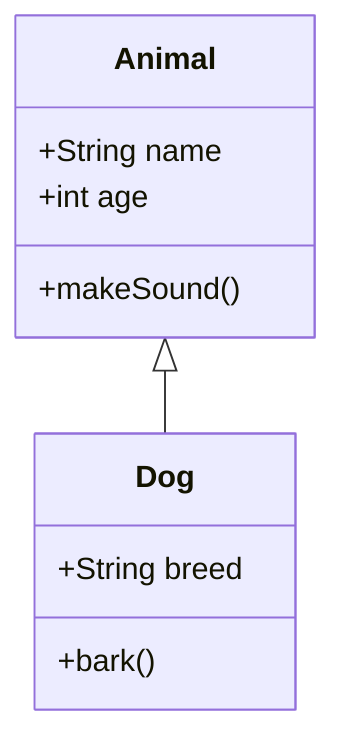
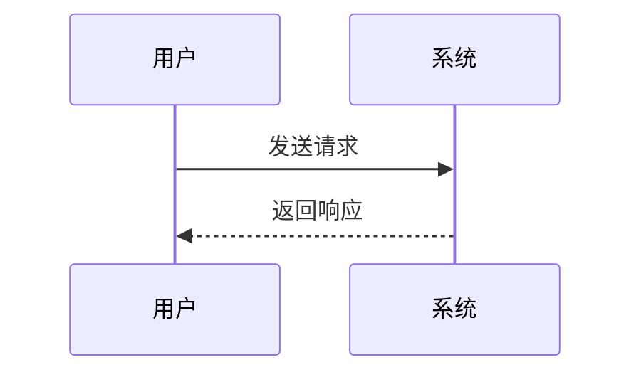

# Mermaid 测试文档

这个文档用于测试 Mermaid 图表是否能正常显示。

## 测试 1：简单流程图



---

## 测试 2：类图（UML）



---

## 测试 3：时序图



---

## 检查说明

### ✅ 正常显示
如果看到三个图表（不是代码），说明 Mermaid 工作正常！

### ❌ 看到代码
如果看到的是彩色的代码文本而不是图表，说明：
1. Mermaid 库未加载
2. Mermaid 渲染器未工作
3. 需要刷新页面（F5）

### 🔍 调试步骤
按 F12 打开控制台，输入：
```javascript
typeof mermaid  // 应该返回 "object"
document.querySelectorAll('.mermaid').length  // 应该返回 3
```

如果第一个返回 `"undefined"`，说明 Mermaid 库没有加载。
如果第二个返回 `0`，说明代码块没有被正确识别。

---

**刷新页面（F5）后再试！** 🔄
