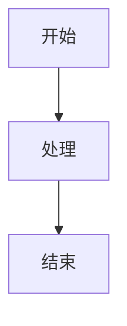
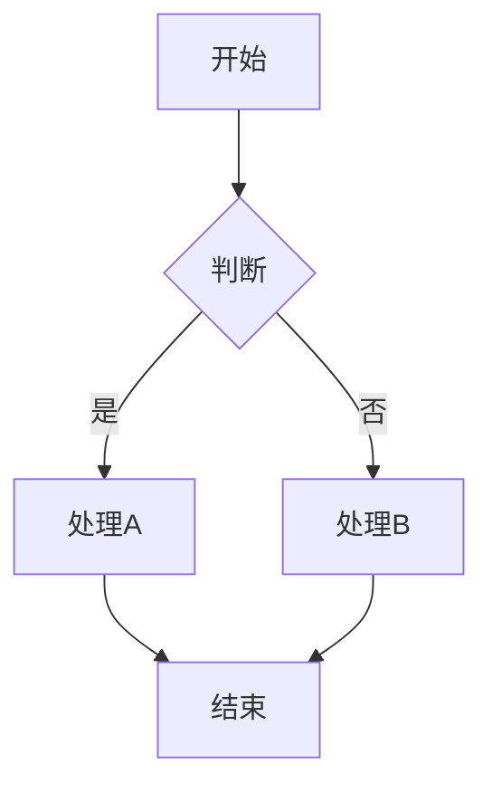
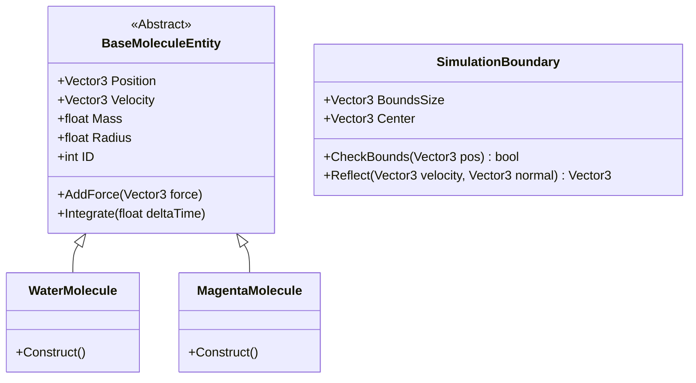
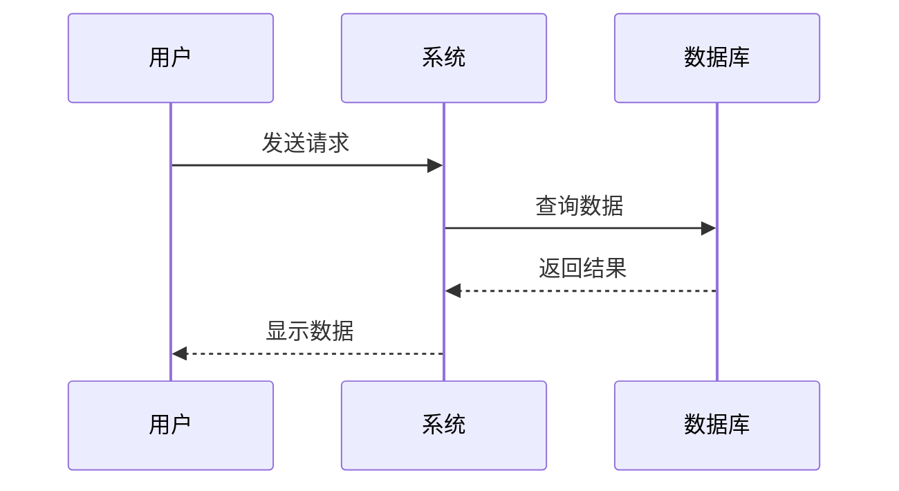
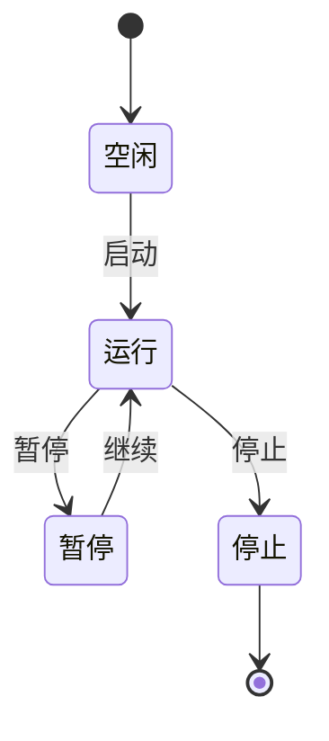
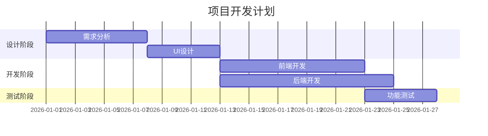
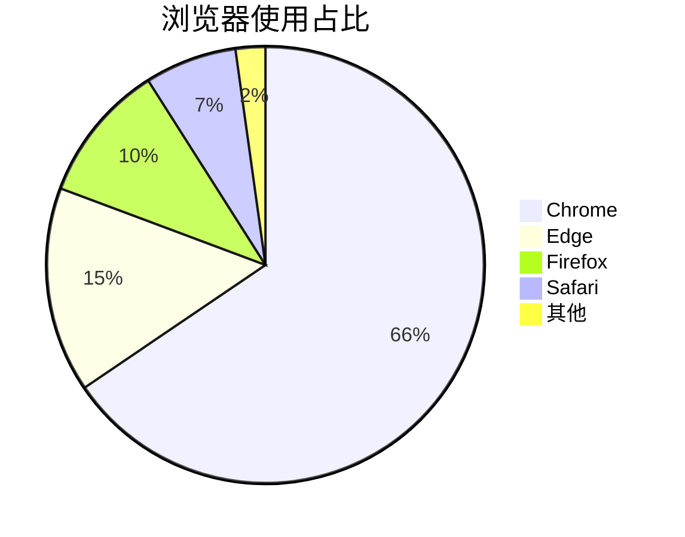
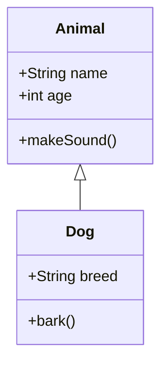
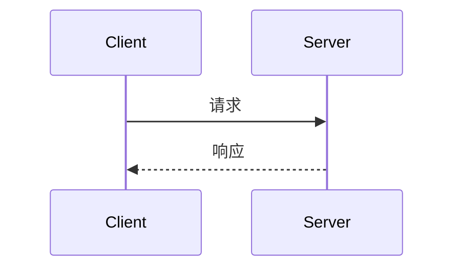
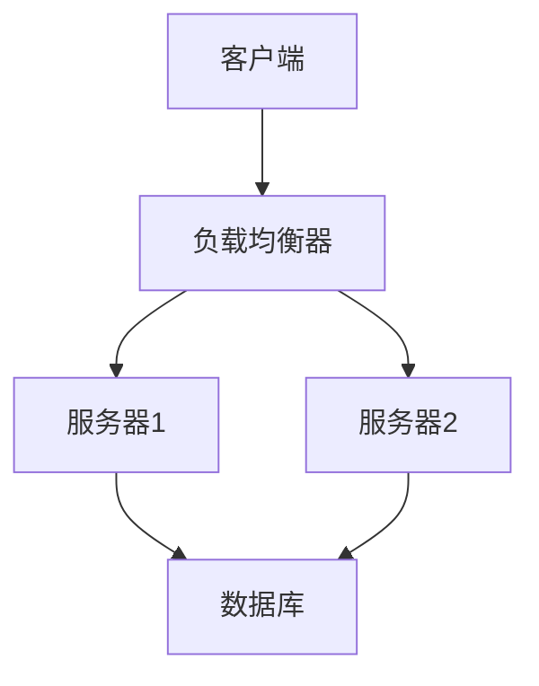

# Mermaid 图表渲染测试

## ✅ MD Viewer 已支持 Mermaid！

你的 MD Viewer 已经完全支持 Mermaid 图表渲染，包括：

- ✅ 类图 (Class Diagram)
- ✅ 时序图 (Sequence Diagram)
- ✅ 流程图 (Flowchart)
- ✅ 状态图 (State Diagram)
- ✅ 甘特图 (Gantt Chart)
- ✅ 饼图 (Pie Chart)
- ✅ ER 图 (Entity Relationship)
- ✅ 用户旅程图 (User Journey)

## 🎯 如何在文档中使用

只需要在 Markdown 中使用这种格式：

````markdown

````

## 📊 示例 1：简单流程图



## 🏗️ 示例 2：类图（你的 UML）



## 📈 示例 3：时序图



## 🔄 示例 4：状态图



## 📅 示例 5：甘特图



## 🥧 示例 6：饼图



## 🎨 主题配置

MD Viewer 当前使用 Mermaid 默认主题。如果你的 UML 图表显示不清楚，可以调整主题配置。

### 当前配置（在 standalone-app.js 中）

```javascript
mermaid.initialize({
    startOnLoad: false,
    theme: 'default',      // 可选: default, forest, dark, neutral
    securityLevel: 'loose',
});
```

### 可用主题

1. **default** - 默认主题（蓝色系）
2. **forest** - 森林主题（绿色系）
3. **dark** - 深色主题（适合深色模式）
4. **neutral** - 中性主题（灰色系）

## 🔧 如果图表不显示

### 检查清单

1. ✅ **代码块语言标记**
   ```
   正确: ```mermaid
   错误: ```Mermaid 或 ```MERMAID
   ```

2. ✅ **语法正确性**
   - 确保 Mermaid 语法没有错误
   - 可以在 [Mermaid Live Editor](https://mermaid.live/) 测试

3. ✅ **浏览器控制台**
   - 按 F12 打开开发者工具
   - 查看 Console 中是否有错误信息

4. ✅ **CDN 加载**
   - 确保网络连接正常
   - Mermaid 库能正常加载

## 📝 你的 UML 文档支持情况

根据你提供的 `03_UML_Diagrams.md` 文件：

### ✅ 类图 - 完全支持


### ✅ 时序图 - 完全支持


### ✅ 部署图 - 完全支持


## 💡 优化建议

### 1. 调整深色模式下的 Mermaid 主题

如果你经常使用深色模式，可以让 Mermaid 根据主题自动切换：

**修改位置**: `public/js/standalone-app.js` 的 `initMarked()` 函数

```javascript
// 根据当前主题选择 Mermaid 主题
const isDark = document.body.getAttribute('data-theme') === 'dark';
mermaid.initialize({
    startOnLoad: false,
    theme: isDark ? 'dark' : 'default',
    securityLevel: 'loose',
});
```

### 2. 增加图表缩放功能

对于复杂的大型 UML 图，可以添加缩放功能：

```css
/* 在 markdown.css 中添加 */
.mermaid {
    overflow: auto;
    max-width: 100%;
    cursor: grab;
}
```

### 3. 导出图表为图片

可以添加一个功能，将 Mermaid 图表导出为 PNG/SVG。

## 🎉 测试你的 UML 文档

现在你可以：

1. **打开 MD Viewer** 的 standalone.html
2. **选择文件夹** `i:\TestProject\UENative_PH\Documentation\Design\`
3. **打开文件** `03_UML_Diagrams.md`
4. **查看效果** - 所有 Mermaid 图表应该都能正常显示！

## 📚 更多 Mermaid 资源

- [官方文档](https://mermaid.js.org/)
- [在线编辑器](https://mermaid.live/)
- [语法参考](https://mermaid.js.org/intro/)
- [更多示例](https://mermaid.js.org/ecosystem/integrations.html)

---

**如果图表显示正常，你的 UML 文档就可以完美渲染了！** 🎊
