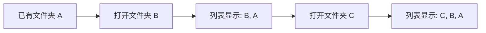
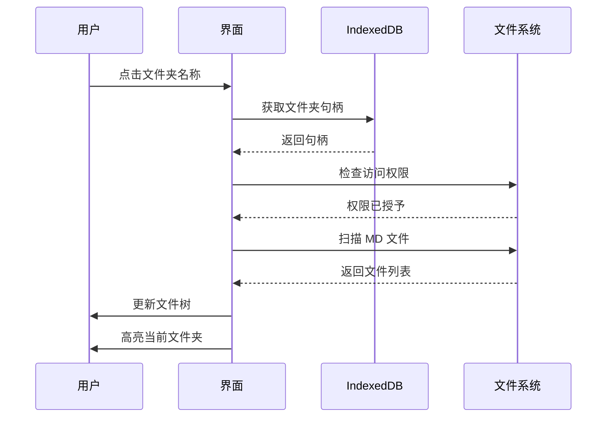
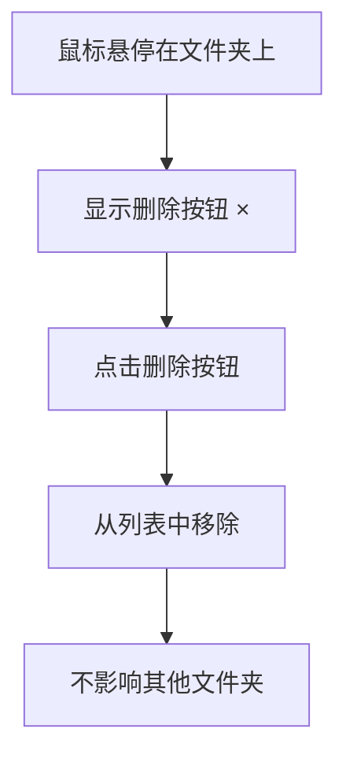

# 最近打开文件夹 - 使用演示

## 功能演示流程

### 第一步：打开第一个文件夹


**操作**：
1. 点击侧边栏的 "打开文件夹" 按钮
2. 在系统对话框中选择一个包含 Markdown 文件的文件夹
3. 文件夹会自动添加到"最近打开"列表

**预期结果**：
- 文件树显示该文件夹下的所有 Markdown 文件
- "最近打开"区域出现，显示刚打开的文件夹
- 该文件夹被高亮显示（蓝色背景）

---

### 第二步：打开更多文件夹



**操作**：
1. 再次点击 "打开文件夹" 按钮
2. 选择另一个不同的文件夹
3. 重复此操作打开多个文件夹

**预期结果**：
- 每个新打开的文件夹都会添加到列表顶部
- 最新打开的文件夹排在最前面
- 列表按打开时间倒序排列

---

### 第三步：快速切换文件夹



**操作**：
1. 在"最近打开"列表中找到想要切换的文件夹
2. 点击文件夹名称或前面的文件夹图标

**预期结果**：
- 文件树立即更新，显示该文件夹的内容
- 该文件夹在列表中被高亮显示
- 如果之前打开了某个文件，会关闭并回到欢迎页

---

### 第四步：删除不需要的文件夹



**操作**：
1. 将鼠标悬停在想要删除的文件夹项上
2. 右侧会出现一个红色的 × 按钮
3. 点击该按钮

**预期结果**：
- 该文件夹从"最近打开"列表中消失
- 如果删除的是当前打开的文件夹，界面保持不变
- 只是从历史记录中移除，不影响实际文件

---

## 界面元素说明

### 最近打开区域结构

```
┌─ 最近打开 ──────────────────┐
│ 📜 最近打开                 │
├─────────────────────────────┤
│ 📁 Project-A         [×]    │ ← 当前活动（蓝色）
│ 📁 Docs-B            [×]    │
│ 📁 Notes-C           [×]    │
│ 📁 Wiki-D            [×]    │
└─────────────────────────────┘
```

### 视觉反馈

1. **正常状态**
   - 文件夹图标：黄色 📁
   - 文字：默认颜色
   - 删除按钮：隐藏

2. **悬停状态**
   - 背景：浅灰色
   - 删除按钮：显示（灰色）

3. **活动状态**
   - 背景：浅蓝色
   - 左边框：蓝色粗线
   - 文字：高亮

4. **删除按钮悬停**
   - 背景：红色
   - 文字：白色

---

## 使用场景示例

### 场景 1：多项目文档管理

**情况**：同时维护 3 个项目的文档

```
项目文档目录：
- /work/project-a/docs
- /work/project-b/docs  
- /work/project-c/docs
```

**工作流程**：
1. 周一：打开 project-a 的文档，编写需求
2. 周二：切换到 project-b，更新设计文档
3. 周三：快速切换到 project-a 查看需求
4. 周四：切换到 project-c 编写测试用例

**优势**：无需每次都点"打开文件夹"并浏览到目录

---

### 场景 2：工作与学习分离

**情况**：白天工作，晚上学习

```
- /work/company-docs    (工作文档)
- /personal/study-notes (学习笔记)
- /personal/blog        (个人博客)
```

**工作流程**：
- 上班：快速切换到 company-docs
- 下班：切换到 study-notes 或 blog
- 周末：只在个人目录间切换

---

### 场景 3：临时查阅

**情况**：需要临时查看某个文档

```
常用目录：
- /main/current-project

临时目录：
- /archive/old-project
- /downloads/temp-docs
```

**工作流程**：
1. 正常在 current-project 工作
2. 打开 old-project 查阅旧文档
3. 通过列表快速切回 current-project
4. 如果不想保留 old-project，删除它

---

## 最佳实践

### ✅ 推荐做法

1. **定期清理**：删除不再需要的临时文件夹
2. **命名规范**：给文件夹起有意义的名称
3. **分类管理**：把相关文档放在同一文件夹
4. **频繁使用**：充分利用快速切换功能

### ❌ 注意事项

1. **权限过期**：浏览器可能会撤销文件夹访问权限
   - 解决：重新授权即可
   
2. **文件夹移动**：如果文件夹被移动或删除
   - 表现：切换时会提示错误
   - 解决：从列表中删除，重新打开

3. **最多10个**：超过会自动删除最旧的
   - 建议：及时清理不需要的文件夹

---

## 技术限制

### 浏览器要求

- ✅ Chrome 86+
- ✅ Edge 86+  
- ❌ Firefox (不支持 File System Access API)
- ❌ Safari (不支持 File System Access API)

### 存储说明

- 使用 IndexedDB 本地存储
- 数据不会上传到云端
- 清除浏览器数据会删除历史记录
- 不同浏览器的数据是独立的

---

## 常见问题

**Q: 最多能保存多少个文件夹？**  
A: 最多10个，超过后会自动删除最旧的。

**Q: 删除文件夹会删除实际文件吗？**  
A: 不会，只是从历史记录中移除，不影响文件系统。

**Q: 为什么有时候无法切换文件夹？**  
A: 可能是权限过期，重新授权即可。

**Q: 可以在不同电脑上同步吗？**  
A: 不可以，数据只存储在本地浏览器中。

**Q: 关闭浏览器后历史记录还在吗？**  
A: 在，除非清除浏览器数据。

---

## 反馈与建议

如果你有任何问题或建议，欢迎在 GitHub 提 Issue！
