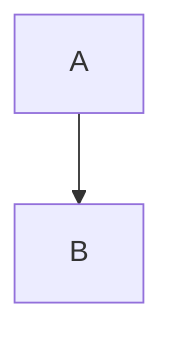

# 代码高亮安全修复说明

## 问题描述

之前的实现存在双重代码高亮的问题：
1. 在 marked.js 的 renderer 中使用 `hljs.highlight()` 处理代码
2. 在 `updatePreview()` 中再次使用 `hljs.highlightElement()` 处理

这导致了 highlight.js 的安全警告：
```
One of your code blocks includes unescaped HTML. This is a potentially serious security risk.
```

## 解决方案

### 修改 1: Marked Renderer

**之前的代码**：
```javascript
renderer.code = (code, language) => {
    // 在这里就进行高亮处理
    highlighted = hljs.highlight(code, { language }).value;
    return `<pre><code class="hljs">${highlighted}</code></pre>`;
};
```

**修改后的代码**：
```javascript
renderer.code = (code, language) => {
    if (language === 'mermaid') {
        return `<div class="mermaid">${code}</div>`;
    }
    
    // 只转义 HTML，不进行高亮
    const escapedCode = code
        .replace(/&/g, '&amp;')
        .replace(/</g, '&lt;')
        .replace(/>/g, '&gt;')
        .replace(/"/g, '&quot;')
        .replace(/'/g, '&#039;');
    
    return `<pre><code class="language-${language}">${escapedCode}</code></pre>`;
};
```

### 修改 2: UpdatePreview 方法

**修改后的代码**：
```javascript
updatePreview() {
    this.preview.innerHTML = marked.parse(content);
    
    // 统一在 DOM 更新后进行高亮
    this.preview.querySelectorAll('pre code:not(.mermaid)').forEach((block) => {
        delete block.dataset.highlighted; // 清除旧标记
        try {
            hljs.highlightElement(block); // 安全地高亮
        } catch (error) {
            console.warn('[Preview] 代码高亮失败:', error);
        }
    });
}
```

## 优点

1. **避免双重处理** - 代码只被高亮一次
2. **安全** - HTML 内容被正确转义
3. **性能更好** - 减少了不必要的处理
4. **错误处理** - 添加了 try-catch 防止高亮失败影响整体渲染

## 安全最佳实践

### HTML 转义

所有用户输入的代码内容都应该被转义：

```javascript
const escape = (html) => html
    .replace(/&/g, '&amp;')
    .replace(/</g, '&lt;')
    .replace(/>/g, '&gt;')
    .replace(/"/g, '&quot;')
    .replace(/'/g, '&#039;');
```

### 使用 highlightElement 而非 highlight

- ✅ `hljs.highlightElement(domElement)` - 推荐，安全
- ❌ `hljs.highlight(code).value` - 可能有 XSS 风险

### 标记检查

```javascript
// 避免重复高亮
if (!block.dataset.highlighted) {
    hljs.highlightElement(block);
}
```

## 测试

### 测试用例 1: 包含 HTML 的代码

```html
<script>alert('XSS')</script>
<div onclick="alert('click')">危险内容</div>
```

**预期结果**: 应该显示为纯文本，不执行 JavaScript

### 测试用例 2: 特殊字符

```javascript
const html = '<div class="test">Hello & goodbye</div>';
const quote = "It's a 'test'";
```

**预期结果**: 所有特殊字符正确显示

### 测试用例 3: Mermaid 图表



**预期结果**: 正常渲染为 Mermaid 图表

## 相关链接

- [Highlight.js 安全指南](https://github.com/highlightjs/highlight.js/wiki/security)
- [Marked.js 文档](https://marked.js.org/)
- [OWASP XSS 防护](https://owasp.org/www-community/attacks/xss/)

## 更新日志

- **v1.7.2** (2026-01-12)
  - 🔒 修复代码高亮的安全漏洞
  - ⚡ 优化代码高亮性能（避免双重处理）
  - 🐛 添加错误处理防止高亮失败
  - ✨ 正确转义 HTML 内容
