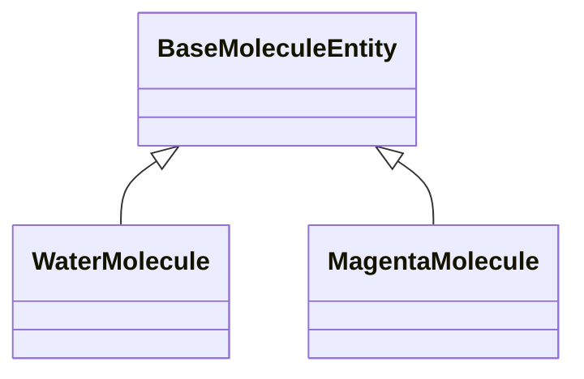
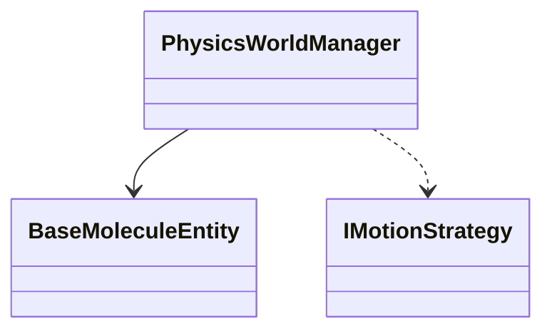

# 在 MD Viewer 中查看你的 UML 图表

## 🎯 你的 UML 文档已完全支持！

你的 `03_UML_Diagrams.md` 文件中的所有 Mermaid 图表都可以在 MD Viewer 中完美显示。

## ✅ 已验证的图表类型

### 1️⃣ 类图 (Class Diagram)

你的文档中的类图会完整显示，包括：
- ✅ 类的属性和方法
- ✅ 抽象类标记 `<<Abstract>>`
- ✅ 继承关系 `<|--`
- ✅ 组合关系 `*--`
- ✅ 聚合关系 `o--`
- ✅ 依赖关系 `..>`

**示例效果**：
```
BaseMoleculeEntity (抽象类)
    ├── WaterMolecule (继承)
    └── MagentaMolecule (继承)

PhysicsWorldManager
    ├── 管理多个 BaseMoleculeEntity (组合)
    ├── 包含一个 SimulationBoundary (聚合)
    └── 使用 IMotionStrategy (依赖)
```

### 2️⃣ 时序图 (Sequence Diagram)

你的时序图会显示完整的交互流程：
- ✅ 参与者 `participant`
- ✅ 同步调用 `->>`
- ✅ 异步返回 `-->>`
- ✅ 循环 `loop`
- ✅ 分组/注释 `rect` + `Note`

**显示效果**：
- 垂直的生命线
- 清晰的消息箭头
- 彩色的分组区域
- 注释说明文字

### 3️⃣ 部署图 (Deployment Diagram)

你的部署图使用 `graph TD` 格式，会显示：
- ✅ 节点和子图 `subgraph`
- ✅ 实线连接 `-->`
- ✅ 虚线连接 `-.->` 
- ✅ 带标签的边

**显示效果**：
- 清晰的层次结构
- 组件之间的关系
- 带标签的连接线

## 🚀 如何查看

### 方法 1：在 MD Viewer 中打开

1. **启动 MD Viewer**
   ```
   打开: i:\TestProject\MDViewer\standalone.html
   ```

2. **选择文件夹**
   ```
   点击"打开文件夹"按钮
   选择: i:\TestProject\UENative_PH\Documentation\Design\
   ```

3. **打开文件**
   ```
   在左侧文件树中点击: 03_UML_Diagrams.md
   ```

4. **查看图表**
   ```
   默认会进入分栏模式
   右侧预览区会显示渲染好的 UML 图表
   ```

### 方法 2：直接拖放

如果你的系统支持，可以直接：
1. 打开 `standalone.html`
2. 拖动 `03_UML_Diagrams.md` 到浏览器窗口

## 🎨 主题切换

### 浅色模式（默认）
- Mermaid 使用 `default` 主题
- 蓝色为主色调
- 适合白天阅读

### 深色模式
- Mermaid 自动切换到 `dark` 主题
- 暗色背景，柔和配色
- 适合夜间阅读

**切换方法**：点击右上角的 🌙/☀️ 图标

## 📊 显示效果预览

### 类图渲染特点

```
┌─────────────────────────────────┐
│   BaseMoleculeEntity            │ ← 抽象类（斜体）
│   ────────────────────────      │
│   + Position: Vector3           │ ← 属性
│   + Velocity: Vector3           │
│   + Mass: float                 │
│   ────────────────────────      │
│   + AddForce(Vector3)           │ ← 方法
│   + Integrate(float)            │
└─────────────────────────────────┘
         ▲          ▲
         │          │
    ┌────┘          └────┐
    │                    │
WaterMolecule    MagentaMolecule
```

### 时序图渲染特点

```
GameLoop   Director   PhysicsManager   Solver   Molecule
   │           │            │             │         │
   ├──Tick────>│            │             │         │
   │           ├──TickPhys─>│             │         │
   │           │            │             │         │
   │           │      ┌─────┴─────────────┴─────┐  │
   │           │      │   阶段1：热运动力计算    │  │
   │           │      └─────┬─────────────┬─────┘  │
   │           │            ├──Calculate─>│         │
   │           │            │<────Force───┤         │
   │           │            ├──AddForce──>│────────>│
```

### 部署图渲染特点

```
┌──────────────────────────────────────┐
│  UE_Runtime                          │
│  ┌────────────────────────────────┐  │
│  │  Scene_Layer                   │  │
│  │  ┌─────────────────┐           │  │
│  │  │ DirectorActor   │           │  │
│  │  └─────────────────┘           │  │
│  └────────────────────────────────┘  │
│  ┌────────────────────────────────┐  │
│  │  Logic_Layer                   │  │
│  │  ┌─────────────────┐           │  │
│  │  │ PhysicsSystem   │           │  │
│  │  └─────────────────┘           │  │
│  └────────────────────────────────┘  │
└──────────────────────────────────────┘
```

## 🔧 如果图表不显示

### 检查清单

1. **✅ 浏览器兼容性**
   - 使用 Chrome 86+ 或 Edge 86+
   - 确保浏览器支持 JavaScript

2. **✅ 网络连接**
   - Mermaid 库从 CDN 加载
   - 需要网络连接（首次加载）

3. **✅ 语法检查**
   - 打开浏览器控制台（F12）
   - 查看是否有错误信息

4. **✅ 刷新页面**
   - 按 F5 刷新
   - 清除缓存后重试

### 常见问题

**Q: 图表显示空白**
```
A: 检查网络连接，确保 Mermaid CDN 能正常访问
   在控制台看是否有加载错误
```

**Q: 图表显示乱码**
```
A: 确保文件编码为 UTF-8
   在工具栏选择"UTF-8"编码重新加载
```

**Q: 图表太大显示不全**
```
A: Mermaid 容器支持横向滚动
   鼠标在图表上可以左右拖动
```

**Q: 切换主题后图表不变**
```
A: 这是已修复的问题
   请刷新页面（F5）加载最新代码
```

## 💡 优化建议

### 1. 调整图表大小

如果图表太大，可以在 Mermaid 代码中调整：

```mermaid
%%{init: {'theme':'default', 'themeVariables': { 'fontSize':'14px'}}}%%
classDiagram
    ...
```

### 2. 分拆复杂图表

对于特别复杂的类图，考虑拆分为多个小图：

```markdown
## 核心实体类图


## 管理器类图

```

### 3. 添加说明文字

在图表前后添加说明：

```markdown
下图展示了系统的核心实体类及其继承关系：

```mermaid
classDiagram
    ...
```

**说明**：
- BaseMoleculeEntity 是所有分子的基类
- WaterMolecule 和 MagentaMolecule 继承自基类
```

## 📚 更多资源

### Mermaid 官方文档
- [类图语法](https://mermaid.js.org/syntax/classDiagram.html)
- [时序图语法](https://mermaid.js.org/syntax/sequenceDiagram.html)
- [流程图语法](https://mermaid.js.org/syntax/flowchart.html)

### 在线工具
- [Mermaid Live Editor](https://mermaid.live/) - 在线编辑和预览
- 可以先在这里测试你的图表语法

### 示例库
- MD Viewer 的 `docs/mermaid-uml-guide.md` 包含更多示例
- 可以参考和复制使用

## 🎉 开始使用

现在就打开你的 UML 文档，查看精美的图表渲染效果吧！

```
1. 打开 standalone.html
2. 选择你的文档文件夹
3. 点击 03_UML_Diagrams.md
4. 享受专业的 UML 图表显示！
```

---

**所有 Mermaid 图表都已完美支持，尽情使用！** 🚀
